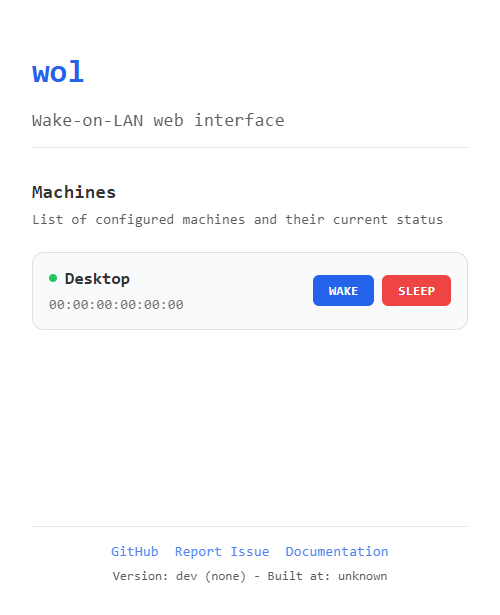

# wol 🦭

A CLI tool to send Wake-On-LAN (WOL) magic packets to wake up devices on your
network. Features both CLI commands and a web interface.



## Features

- Send WOL magic packets via CLI or web interface
- Configure multiple machines with names for easy access
- List configured machines
- Web interface for easy wake-up
- Docker support

## Installation

### Download Binary

Download the latest release for your platform from the
[releases page](https://github.com/trugamr/wol/releases).

Available for:

- Linux (x86_64, arm64)
- macOS (x86_64, arm64)
- Windows (x86_64)

### Using Go

```sh
go install github.com/trugamr/wol@latest
```

## Configuration

Create a `config.yaml` file in one of these locations (in order of precedence):

- `./config.yaml` (current directory)
- `~/.wol/config.yaml` (home directory)
- `/etc/wol/config.yaml` (system-wide)

Example configuration:

```yaml
machines:
  - name: desktop
    mac: "00:11:22:33:44:55"
    ip: "192.168.1.100" # Optional, for status checking
  - name: server
    mac: "AA:BB:CC:DD:EE:FF"
    ip: "192.168.1.101" # Optional, for status checking

server:
  listen: ":7777" # Optional, defaults to :7777
```

## Usage

### CLI Commands

```sh
# List all configured machines
wol list

# Wake up a machine by name
wol send --name desktop

# Wake up a machine by MAC address
wol send --mac "00:11:22:33:44:55"

# Start the web interface
wol serve

# Show version information
wol version
```

### Web Interface

The web interface is available at `http://localhost:7777` when running the serve
command. It provides:

- List of all configured machines
- One-click wake up buttons
- Real-time machine status monitoring (when IP is configured)
- Version information
- Links to documentation and support

## Building from Source

```sh
# Clone the repository
git clone https://github.com/trugamr/wol.git
cd wol

# Build
go build

# Run
./wol
```

## License

This project is licensed under the MIT License. See the [LICENSE](LICENSE.md)
file for details.

## Contributing

Contributions are welcome! Feel free to open issues or submit pull requests.
